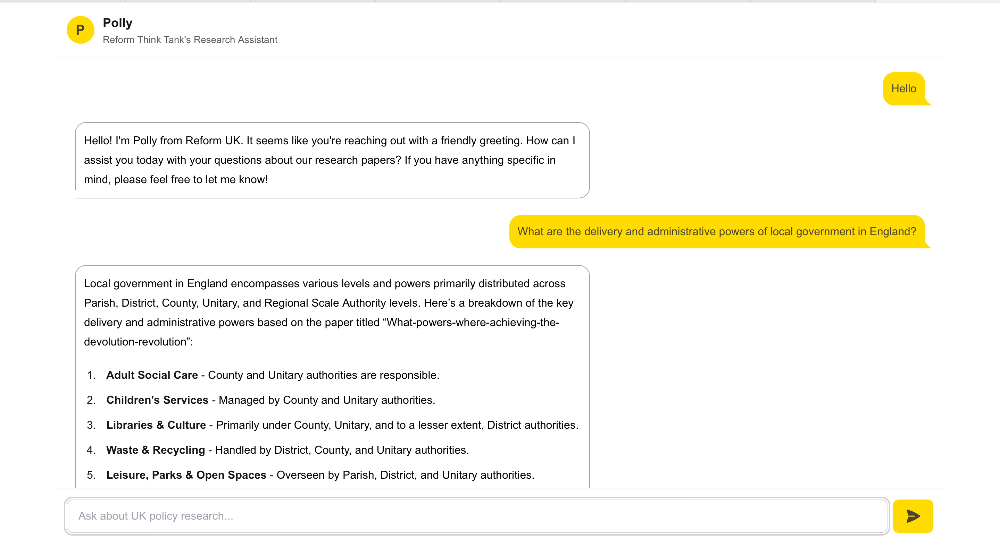
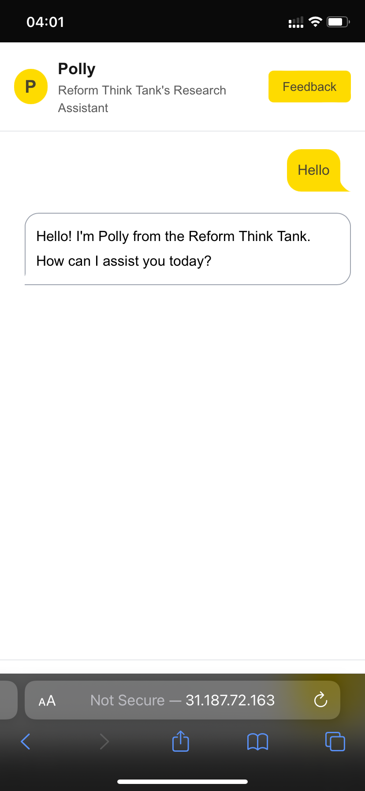

## Polly - A Policy Research Agent
A policy research agent that uses research papers and web search to answer questions on UK policy reform

## Use Cases
1. Find relevant info from past research & online content
2. Summarize research papers and key ideas
3. Writing policy analysis and run reform thought experiments

## Tech Stack - Front End
- Next JS
- Typescript
- Tailwind CSS
- Daisy UI

## Screenshots

Display on computer:

Display on mobile:

